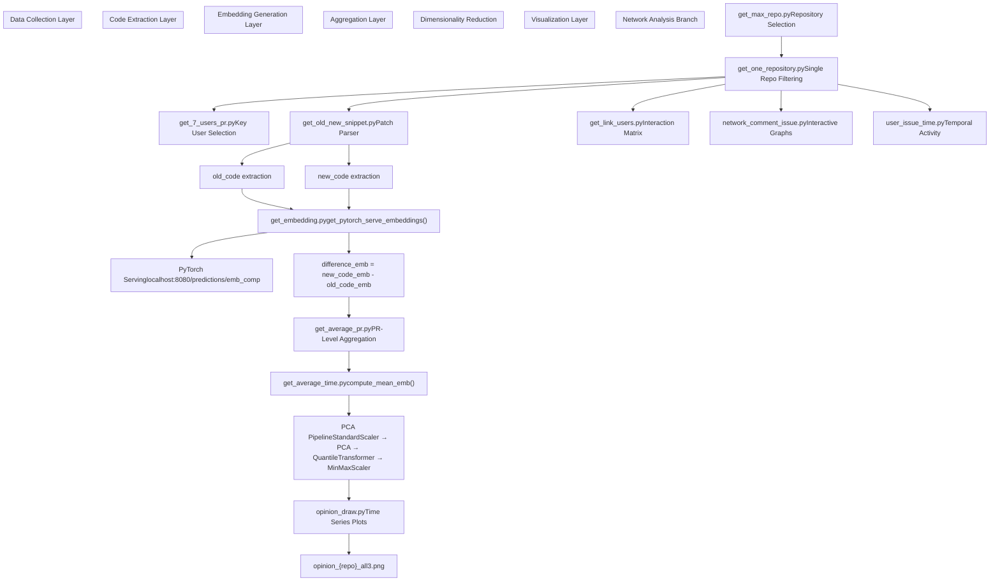
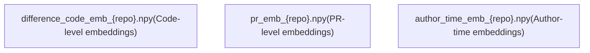
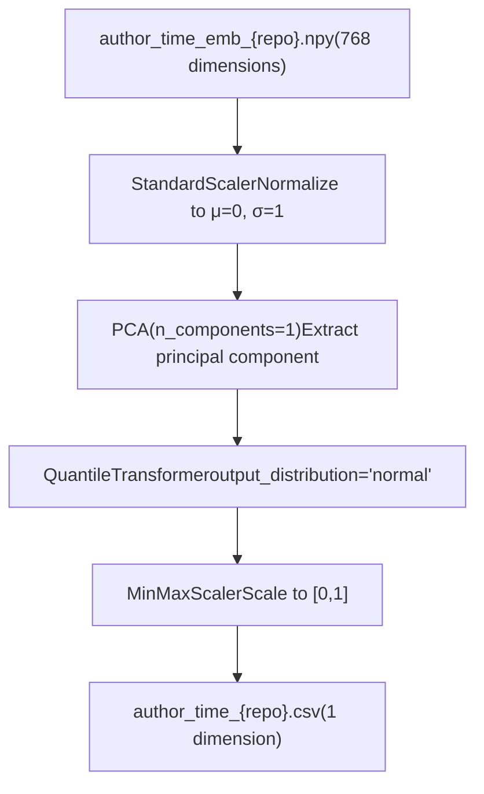
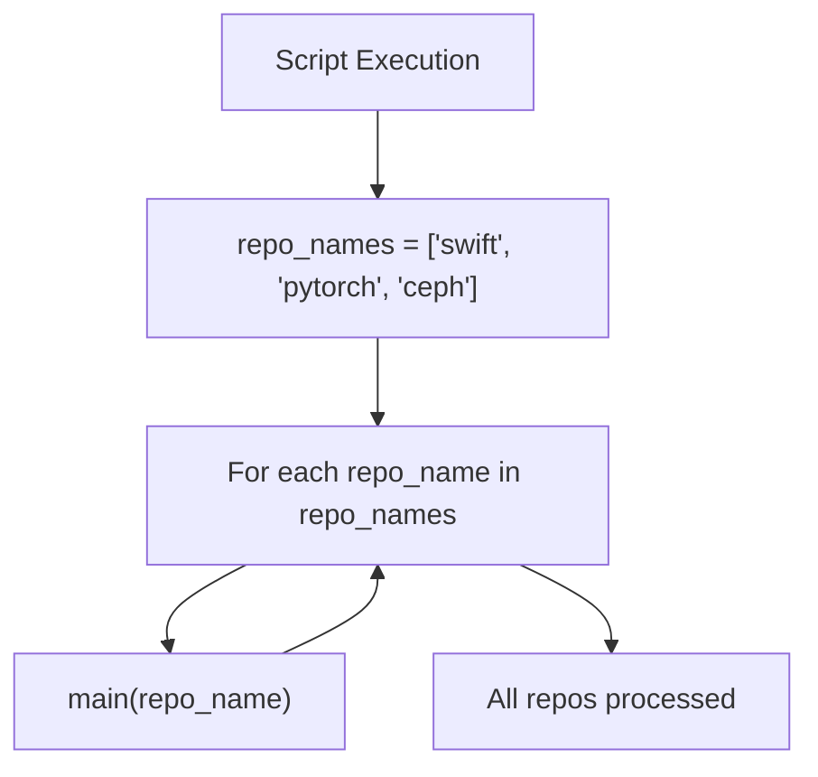

# Overview

(generated by deepwiki)

## Purpose and Scope

The GitHub Opinion Dynamics system is a research pipeline designed to analyze how developer "opinions" evolve over time within software development communities. The system treats code changes as expressions of opinion, using machine learning embeddings to quantify semantic differences between old and new code versions. By aggregating and analyzing these embeddings across authors and time periods, the system produces time-series visualizations showing how different contributors' coding approaches converge or diverge.

This document provides a high-level introduction to the system architecture, data flow, and key components. For detailed information about specific subsystems:

* Data collection and filtering: see [Data Collection Pipeline](/hreyulog/github_opinion_dynamics/2-data-collection-pipeline)
* Embedding generation process: see [Embedding Generation System](/hreyulog/github_opinion_dynamics/3-embedding-generation-system)
* PCA and dimensionality reduction: see [Opinion Analysis and Dimensionality Reduction](/hreyulog/github_opinion_dynamics/5-opinion-analysis-and-dimensionality-reduction)
* Visualization outputs: see [Visualization and Output](/hreyulog/github_opinion_dynamics/6-visualization-and-output)
* Network analysis: see [Network Analysis](/hreyulog/github_opinion_dynamics/7-network-analysis)

## System Architecture

The system follows a multi-stage pipeline architecture, processing GitHub repository data through several transformation layers:

### High-Level Architecture Diagram

**Sources:** [get_embedding.py L1-L44](https://github.com/hreyulog/github_opinion_dynamics/blob/6e264d44/get_embedding.py#L1-L44)

 [get_old_new_snippet.py L1-L89](https://github.com/hreyulog/github_opinion_dynamics/blob/6e264d44/get_old_new_snippet.py#L1-L89)

 [get_average_time.py L1-L124](https://github.com/hreyulog/github_opinion_dynamics/blob/6e264d44/get_average_time.py#L1-L124)

### Core Data Flow

The system processes data through seven distinct stages:

| Stage | Input | Process | Output | Key Script |
| --- | --- | --- | --- | --- |
| **1. Repository Selection** | GitHub PR data | Filter by issue count | `filtered_pr_{repo}.csv` | `get_max_repo.py` |
| **2. User Identification** | PR metadata | Identify top 7 contributors | User list | `get_7_users_pr.py` |
| **3. Code Extraction** | Git patches | Parse diffs into old/new code | `{repo}_diff.csv` | `get_old_new_snippet.py` |
| **4. Embedding Generation** | Code snippets | Query PyTorch model | `difference_code_emb_{repo}.npy` | `get_embedding.py` |
| **5. PR Aggregation** | Difference embeddings | Mean by PR | `pr_emb_{repo}.npy` | `get_average_pr.py` |
| **6. Author-Time Aggregation** | PR embeddings | Mean by author + time | `author_time_emb_{repo}.npy` | `get_average_time.py` |
| **7. Dimensionality Reduction** | 768D embeddings | PCA to 1D | `author_time_{repo}.csv` | `get_average_time.py` |

**Sources:** [get_embedding.py L6-L44](https://github.com/hreyulog/github_opinion_dynamics/blob/6e264d44/get_embedding.py#L6-L44)

 [get_old_new_snippet.py L16-L89](https://github.com/hreyulog/github_opinion_dynamics/blob/6e264d44/get_old_new_snippet.py#L16-L89)

 [get_average_time.py L28-L118](https://github.com/hreyulog/github_opinion_dynamics/blob/6e264d44/get_average_time.py#L28-L118)

## Key Components

### 1. PyTorch Serving Interface

The system relies on an external PyTorch model serving endpoint at `http://localhost:8080/predictions/emb_comp` that converts code strings into 768-dimensional embedding vectors. The `get_pytorch_serve_embeddings()` function handles communication with this service.

**Key Functions:**

* `get_pytorch_serve_embeddings()` in [get_embedding.py L6-L22](https://github.com/hreyulog/github_opinion_dynamics/blob/6e264d44/get_embedding.py#L6-L22)
* POST requests to `localhost:8080/predictions/emb_comp`
* Returns embeddings as `torch.Tensor` objects

**Sources:** [get_embedding.py L6-L26](https://github.com/hreyulog/github_opinion_dynamics/blob/6e264d44/get_embedding.py#L6-L26)

### 2. Patch Parser

The `get_old_new_snippet.py` module parses git diff patches to extract the before/after code states for each file change. It processes patches line-by-line, identifying added lines (`+`), removed lines (`-`), and unchanged context lines.

**Key Processing Steps:**

* Filter files by extension (exclude `.md`, include code files with extensions)
* Parse diff lines starting with `-`, `+`, or context markers
* Remove `@@` hunk headers using regex
* Normalize whitespace to create single-line code strings

**Sources:** [get_old_new_snippet.py L16-L85](https://github.com/hreyulog/github_opinion_dynamics/blob/6e264d44/get_old_new_snippet.py#L16-L85)

### 3. Embedding Aggregation Pipeline

Embeddings are aggregated in two stages using the `compute_mean_emb()` function:

The `compute_mean_emb()` function [get_average_time.py L17-L22](https://github.com/hreyulog/github_opinion_dynamics/blob/6e264d44/get_average_time.py#L17-L22)

 performs array stacking and mean computation:

**Sources:** [get_average_time.py L17-L40](https://github.com/hreyulog/github_opinion_dynamics/blob/6e264d44/get_average_time.py#L17-L40)

 [get_embedding.py L30-L34](https://github.com/hreyulog/github_opinion_dynamics/blob/6e264d44/get_embedding.py#L30-L34)

### 4. Multi-Stage Transformation Pipeline

The dimensionality reduction pipeline in `get_average_time.py` applies four sequential transformations to convert 768D embeddings to interpretable 1D opinion scores:

**Implementation:** [get_average_time.py L46-L58](https://github.com/hreyulog/github_opinion_dynamics/blob/6e264d44/get_average_time.py#L46-L58)

**Sources:** [get_average_time.py L42-L62](https://github.com/hreyulog/github_opinion_dynamics/blob/6e264d44/get_average_time.py#L42-L62)

### 5. Time Series Filtering

The system identifies consecutive time periods where all authors have data, selecting the longest such period for visualization. The algorithm [get_average_time.py L71-L96](https://github.com/hreyulog/github_opinion_dynamics/blob/6e264d44/get_average_time.py#L71-L96)

 groups consecutive months with complete author coverage.

**Key Logic:**

* Sort time periods chronologically
* Group consecutive months where all authors contributed
* Select longest consecutive group
* Apply additional 4-month offset and 12-month window

**Sources:** [get_average_time.py L68-L96](https://github.com/hreyulog/github_opinion_dynamics/blob/6e264d44/get_average_time.py#L68-L96)

## Data Artifacts

The system generates multiple intermediate and final data artifacts at each stage:

### Embedding Artifacts

| Artifact | Dimensions | Description |
| --- | --- | --- |
| `new_code_emb_{repo}.npy` | N × 768 | Embeddings of new code versions |
| `old_code_emb_{repo}.npy` | N × 768 | Embeddings of old code versions |
| `difference_code_emb_{repo}.npy` | N × 768 | Difference embeddings (new - old) |
| `pr_emb_{repo}.npy` | M × 768 | PR-level aggregated embeddings |
| `author_time_emb_{repo}.npy` | K × 768 | Author-time aggregated embeddings |

**Sources:** [get_embedding.py L32-L34](https://github.com/hreyulog/github_opinion_dynamics/blob/6e264d44/get_embedding.py#L32-L34)

 [get_average_time.py

40](https://github.com/hreyulog/github_opinion_dynamics/blob/6e264d44/get_average_time.py#L40-L40)

### Output Artifacts

| Artifact | Format | Description |
| --- | --- | --- |
| `opinion_{repo}_all3.png` | PNG | Time series plot of author opinions |
| `author_time_{repo}.csv` | CSV | Author-time embeddings with 1D PCA scores |
| `{repo}_for_mathematica.csv` | CSV | Pivoted time series for external analysis |
| `pr_time_{repo}.csv` | CSV | PR metadata with timestamps and authors |

**Sources:** [get_average_time.py L62-L117](https://github.com/hreyulog/github_opinion_dynamics/blob/6e264d44/get_average_time.py#L62-L117)

## Execution Model

The system operates in batch mode, processing multiple repositories sequentially:

**Example:** [get_average_time.py L119-L124](https://github.com/hreyulog/github_opinion_dynamics/blob/6e264d44/get_average_time.py#L119-L124)

 shows the standard batch execution pattern used across all main scripts.

**Sources:** [get_average_time.py L119-L124](https://github.com/hreyulog/github_opinion_dynamics/blob/6e264d44/get_average_time.py#L119-L124)

 [get_embedding.py L37-L40](https://github.com/hreyulog/github_opinion_dynamics/blob/6e264d44/get_embedding.py#L37-L40)

 [get_old_new_snippet.py L86-L89](https://github.com/hreyulog/github_opinion_dynamics/blob/6e264d44/get_old_new_snippet.py#L86-L89)

## System Dependencies

### External Services

* **PyTorch Serving**: HTTP endpoint at `localhost:8080` serving the `emb_comp` model
* **Network File System**: Data storage at `/srv/nfs/VESO/...` (referenced in diagrams)

### Python Libraries

* **Data Processing**: `pandas`, `numpy`
* **ML/Dimensionality Reduction**: `sklearn` (PCA, StandardScaler, QuantileTransformer, MinMaxScaler)
* **Deep Learning**: `torch` (for tensor operations)
* **HTTP Communication**: `requests` (for PyTorch Serving API calls)
* **Visualization**: `matplotlib`, `seaborn`, `plotly` (for plots and graphs)
* **Network Analysis**: `networkx` (for graph operations)

**Sources:** [get_average_time.py L1-L12](https://github.com/hreyulog/github_opinion_dynamics/blob/6e264d44/get_average_time.py#L1-L12)

 [get_embedding.py L1-L5](https://github.com/hreyulog/github_opinion_dynamics/blob/6e264d44/get_embedding.py#L1-L5)

## Target Repositories

The system is configured to analyze three large-scale open source projects:

| Repository | Language | Notable Characteristics |
| --- | --- | --- |
| **swift** | Swift | Apple's programming language |
| **pytorch** | Python/C++ | Deep learning framework |
| **ceph** | C++ | Distributed storage system |

These repositories were selected for their high activity levels and diverse contributor bases.

**Sources:** [get_average_time.py

120](https://github.com/hreyulog/github_opinion_dynamics/blob/6e264d44/get_average_time.py#L120-L120)

 [get_embedding.py

38](https://github.com/hreyulog/github_opinion_dynamics/blob/6e264d44/get_embedding.py#L38-L38)

 [get_old_new_snippet.py

87](https://github.com/hreyulog/github_opinion_dynamics/blob/6e264d44/get_old_new_snippet.py#L87-L87)

## System Workflow Summary

The complete execution workflow follows this sequence:

1. **Data Collection** → Filter repositories and identify key contributors
2. **Code Extraction** → Parse git patches into old/new code pairs
3. **Embedding Generation** → Query PyTorch model to get 768D vectors for code
4. **Compute Differences** → Calculate `new_code_emb - old_code_emb`
5. **PR Aggregation** → Average difference embeddings by pull request
6. **Author-Time Aggregation** → Average PR embeddings by author and time period (semi-annual)
7. **PCA Reduction** → Apply 4-stage transformation pipeline to reduce to 1D
8. **Time Filtering** → Select longest consecutive period with complete author coverage
9. **Visualization** → Generate time-series plots showing opinion evolution

Each script in the pipeline writes intermediate results to disk, enabling debugging and pipeline restart from any stage.

**Sources:** [get_embedding.py L24-L40](https://github.com/hreyulog/github_opinion_dynamics/blob/6e264d44/get_embedding.py#L24-L40)

 [get_average_time.py L28-L118](https://github.com/hreyulog/github_opinion_dynamics/blob/6e264d44/get_average_time.py#L28-L118)

 [get_old_new_snippet.py L16-L85](https://github.com/hreyulog/github_opinion_dynamics/blob/6e264d44/get_old_new_snippet.py#L16-L85)
